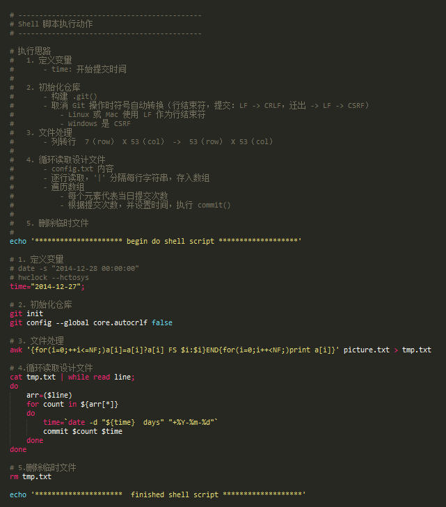
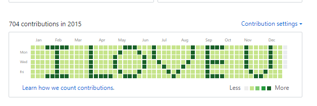
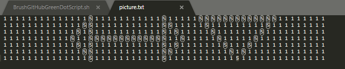
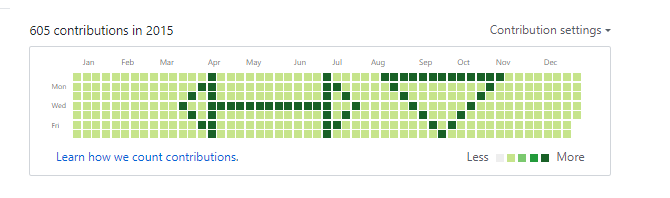
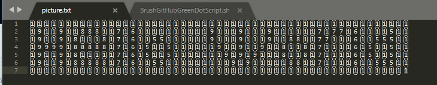
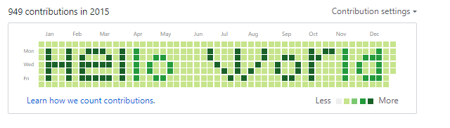
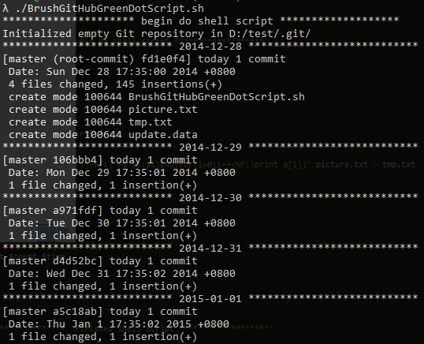
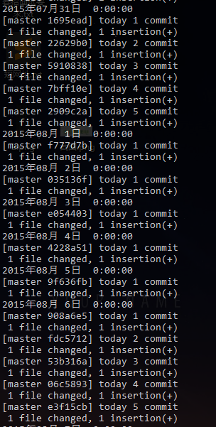
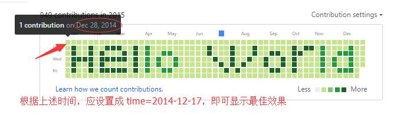

# 刷 GitHub 小绿点工具 （v 1.1）
 利用 Shell 脚本编写，可自定义图案，刷出想要的形状

 ## 前言
- 2018.02.09 中午突然有个想法，昨天写的代码，但是忘记提交到 GitHub，能否实现恢复提交？
- 之前曾经遇到过，Hexo 博客项目，因为不小心删除了博客的 .deploy_git 目录，重新部署生成后，再次提交，导致成为 First Commit ，之前的提交数量为 0（小绿点消失）。
- 动手实践
  - 系统时间设置为昨日，然后重新提交
  - 执行 git log 命令，查看本地提交记录，提示最新一次提交是在昨天（物理世界里的时间，同步与修改后的时间）
  - 调整回今天日期，项目 push 到 GitHub，提示提交是在昨天！个人首页小绿点统计也是统计昨天。实验成功
- 有这个思路，说明 GitHub 小绿点统计是按 commit 的日期统计，不是按 push 日期
- 扩展：那能不能刷出不同形状的图案？

## 实现思路


## 目录说明
```
Bush-GitHub-GreenDot
│  update.data						[commit 更新文件]
│  tmp.txt							[临时文件（执行完自动删除）]
│  BrushGitHubGreenDotScript.sh   	[Shell 脚本]
│  picture.txt					 	[设计图片]
│  README.md					 	[说明书]
│
└─image
        effect1.png					[效果图 1]
        effect2.png					[效果图 2]
        effect3.png					[效果图 3]
        design-effect2.png			[设计图 2]
        design-effect3.png			[设计图 3]
        workingProcess1.png  		[执行状态 1]
        workingProcess2.png			[执行状态 2]
        attention2.png				[注意事项 2]
```

## 效果展示









## 需要环境
1. 支持 shell 脚本运行（window 系统下推荐 cmder 工具，支持 bash）
2. 具备 Git 版本控制系统
3. 具备 Github 账号，有一个空的仓库

## 使用
```
1. 创建一个本地目录
2. 命令行进入本地目录
3. 执行脚本
	chmod u-x BashGitHubGreenDotScript.sh
	./BashGitHubGreenDotScript.sh
4. 等待执行完毕
5. 连接远程仓库
	git remote add origin 你的仓库地址
6. 推送
	git push --set-upstream origin master
```

## 注意
1. 如果中途想停止脚本，在命令行界面按`Ctrl + c`
2. 该脚本默认是 "2014-12-28 00:00:00" 开始，若需调整，可调整 'BrushGitHubGreenDotScript.sh' 文件内 `time="2014-12-28";` 需注意格式 ”年-月-日“ ，建议下图所示设置为前一天，保证与设计效果相符
  - 
3. 可在 picture计图案，每个数字代表提交次数，时间变化（左 -> 右，上 -> 下 递增）（不同的提交会造成小绿点颜色深浅的不同）
4. 可能提交至 Github 不会太快出现效果，请耐心等待 GitHub 服务器响应（约 1 分钟后），可在个人首页看到图案