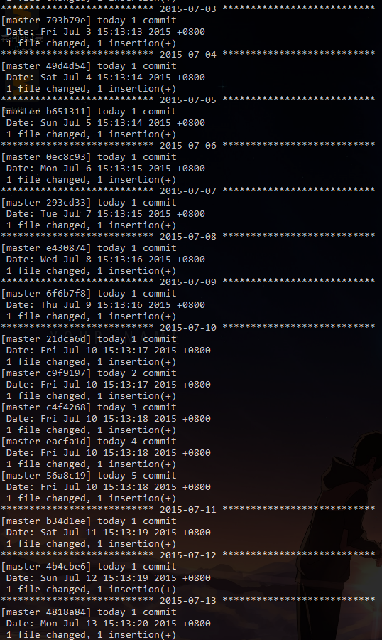

# 刷 GitHub 小绿点工具
 利用 Shell 脚本编写，可自定义图案，刷出想要的形状

 ## 前言
- 2018.02.09 中午突然有个想法，昨天写的代码，但是忘记提交到 GitHub，能否恢复提交？
- 之前曾经遇到过，Hexo 博客项目，因为不小心删除了博客的 .deploy_git 目录，重新部署生成后，再次提交，导致成为 First Commit ，之前的提交数量为 0。
- 思路回到最初，初步尝试
  - 系统时间设置为昨日，然后重新提交
  - 再本地 Git Log 中，当前提交最新日期变成了昨天
  - 调整回今天日期，项目 push 到 GitHub，提示提交是在昨天！个人首页小绿点统计也是统计昨天。实验成功
- 有这个思路，说明 GitHub 小绿点统计是按 commit 的时间统计，不是按 push
- 扩展：那能不能刷出不同形状的图案？

## 实现思路
1. 选定一种实现手段（虽然最熟悉 java，但这种小的 DEMO 还是用脚本语言比较合适）
  - 经过 1min 钟的深思熟虑，选择了 Shell（脚本语言都不是很熟，都得学习哈哈)
2. 编程思维理解步骤
  - 初始化仓库
  - 设置初始系统时间
    - 硬件时间也要同步设置
  - 循环
    - 考虑用一个文件，来设计图片类型
    - 逐行读取，| 分隔字符串
    - 每个字符串代表循环次数（提交次数）
    - 修改系统时间
3. 动手实现

## 目录说明
```
Bush-GitHub-GreenDot
│  BashGitHubGreenDotScript.sh   	[Shell 脚本]
│  config.txt					 	[设计图片]
│  README.md					 	[说明书]
│
└─image
        effect.png					[效果图]
        FinishedLocalDirectory.png  [执行完本地目录图]
        workingProcess1.png  		[执行状态1]
        workingProcess2.png			[执行状态2]
```

## 效果展示





## 需要环境
1. 支持 shell 脚本运行（window 系统下推荐 cmder 工具，支持 bash）
2. 具备 Git 版本控制系统
3. 有一个 Github 仓库

## 使用
```
1. 创建一个本地目录
2. 命令行进入本地目录
3. 执行脚本
	chmod u-x BashGitHubGreenDotScript.sh
	./BashGitHubGreenDotScript.sh
4. 等待执行完毕
5. 连接远程仓库
	git remote add origin 你的仓库地址
6. 推送
	git push --set-upstream origin master
```

## 注意
1. 如果中途想停止脚本，在命令行界面按`Ctrl + c`
2. 执行完脚本后，系统时间会回到“过去”，需重新调整回来
3. 该脚本默认是 "2014-12-28 00:00:00"，开始，截至日期按照 config.txt 内数字进行统计
4. config.txt 脚本，内设计旅店图片，水平方向依次递增天数，每个数字代表当天执行提交次数（绿点颜色深浅）